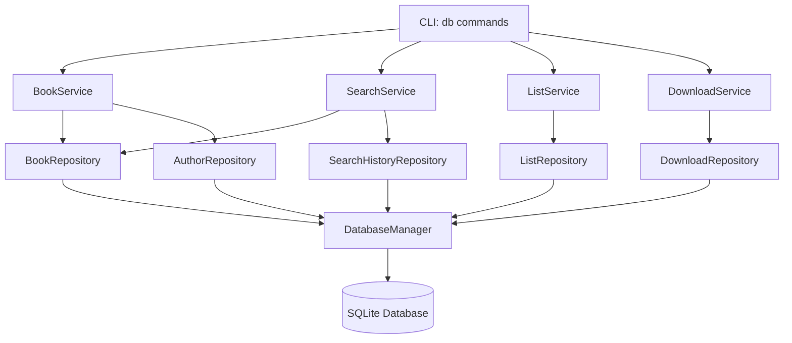

# Design Document

## Overview

The database storage feature adds a persistent SQLite database layer to zlibrary-downloader, enabling local storage and management of book metadata. The design follows a clean three-layer architecture: CLI layer for user interaction, Service layer for business logic, and Repository layer for data access. This architecture maintains strict separation of concerns while integrating seamlessly with the existing codebase patterns (dataclasses, managers, type safety).

The implementation will be fully additive with no breaking changes - all existing commands continue to work unchanged, and database features are opt-in through new `db` subcommands and a `--save-db` flag.

## Steering Document Alignment

### Technical Standards (tech.md)

While no formal tech.md exists yet, this design follows the established patterns in the codebase:
- **Dataclasses for models**: Following the `Credential` pattern for type-safe data models
- **Manager classes**: Following `CredentialManager` and `ClientPool` patterns for component management
- **Enum for status**: Following `CredentialStatus` pattern for type-safe state management
- **Type hints everywhere**: Complete type annotations matching existing strict mypy configuration
- **Error handling**: Graceful error handling with clear user messages
- **Testing patterns**: Using pytest with fixtures following existing `conftest.py` patterns

### Project Structure (structure.md)

The implementation follows the existing flat structure in `zlibrary_downloader/`:
- New modules will be added alongside existing ones (`client.py`, `credential.py`, etc.)
- Database-related code will be in new modules: `db_manager.py`, `models.py`, `repositories.py`, `services.py`
- Each module stays under 400 lines through focused single-responsibility design
- Tests mirror the source structure in `tests/` directory

## Code Reuse Analysis

### Existing Components to Leverage

- **`Credential` dataclass pattern**: Will create similar dataclasses for `Book`, `Author`, `Download` models
- **`CredentialManager`**: Pattern for `DatabaseManager` to handle connection lifecycle
- **CLI argument parsing**: Extend existing `create_argument_parser()` with new `db` subcommand group
- **`display_results()` function**: Reuse for displaying browse results in familiar format
- **`conftest.py` fixtures**: Pattern for creating test database fixtures
- **Type hints style**: Match existing strict typing with `Optional`, `List`, `Dict[str, Any]`

### Integration Points

- **CLI (`cli.py`)**: Add `db` subcommand group; integrate `--save-db` flag into existing `search_books()` function
- **Search flow**: Hook into `search_books()` to optionally store results after fetching from API
- **Download flow**: Hook into `download_book()` to automatically record downloads
- **Client (`client.py`)**: No modifications needed - clean separation through service layer
- **Credentials**: Reference credentials by ID in download tracking (foreign key relationship)

## Architecture

The design follows a **clean three-layer architecture** with strict separation of concerns:

```
┌─────────────────────────────────────────────────────────────────┐
│                      CLI Layer (cli.py)                          │
│  • Argument parsing with argparse                                │
│  • User input/output                                             │
│  • Command routing                                               │
│  • Thin orchestration only                                       │
└────────────────────────┬────────────────────────────────────────┘
                         │
                         ▼
┌─────────────────────────────────────────────────────────────────┐
│              Service Layer (services.py modules)                 │
│  • BookService: Book operations orchestration                    │
│  • SearchService: Search + storage orchestration                 │
│  • ListService: Reading list management                          │
│  • DownloadService: Download tracking                            │
│  • Business logic and validation                                 │
│  • No direct SQL - only repository calls                         │
└────────────────────────┬────────────────────────────────────────┘
                         │
                         ▼
┌─────────────────────────────────────────────────────────────────┐
│         Repository Layer (repositories.py modules)               │
│  • BookRepository: Book CRUD + search queries                    │
│  • AuthorRepository: Author management                           │
│  • ListRepository: Reading list operations                       │
│  • DownloadRepository: Download tracking                         │
│  • SearchHistoryRepository: Search history                       │
│  • All SQL queries isolated here                                 │
└────────────────────────┬────────────────────────────────────────┘
                         │
                         ▼
┌─────────────────────────────────────────────────────────────────┐
│              Database Manager (db_manager.py)                    │
│  • SQLite connection management                                  │
│  • Schema initialization                                         │
│  • Transaction handling                                          │
│  • Following CredentialManager pattern                           │
└────────────────────────┬────────────────────────────────────────┘
                         │
                         ▼
┌─────────────────────────────────────────────────────────────────┐
│                    Data Models (models.py)                       │
│  • Book, Author, ReadingList, Download dataclasses              │
│  • Following Credential dataclass pattern                        │
│  • Immutable, type-safe, serializable                            │
└─────────────────────────────────────────────────────────────────┘
                         │
                         ▼
┌─────────────────────────────────────────────────────────────────┐
│                 SQLite Database (~/.zlibrary/books.db)           │
└─────────────────────────────────────────────────────────────────┘
```

### Modular Design Principles

- **Single File Responsibility**: Each module ≤400 lines, focused on one domain
- **Component Isolation**: Repositories don't call other repositories directly (service orchestration)
- **Service Layer Separation**: Services never write SQL - only call repository methods
- **Utility Modularity**: DB utilities in separate `db_utils.py` (<80 lines)



## Components and Interfaces

### Component 1: DatabaseManager (db_manager.py)

- **Purpose:** Manage SQLite connection lifecycle and schema initialization
- **Interfaces:**
  ```python
  class DatabaseManager:
      def __init__(self, db_path: Optional[Path] = None) -> None
      def get_connection(self) -> sqlite3.Connection
      def initialize_schema(self) -> None
      def close(self) -> None
      def execute_transaction(self, operations: List[Callable]) -> None
  ```
- **Dependencies:** Python stdlib `sqlite3`, `pathlib`
- **Reuses:** Follows `CredentialManager` pattern for lifecycle management
- **File size:** ~150 lines

### Component 2: Data Models (models.py)

- **Purpose:** Type-safe dataclasses for all database entities
- **Interfaces:**
  ```python
  @dataclass
  class Book:
      id: str  # Z-Library ID (primary key)
      hash: str
      title: str
      year: Optional[str] = None
      publisher: Optional[str] = None
      language: Optional[str] = None
      extension: Optional[str] = None
      size: Optional[str] = None
      filesize: Optional[int] = None
      cover_url: Optional[str] = None
      description: Optional[str] = None
      created_at: datetime = field(default_factory=datetime.now)
      updated_at: datetime = field(default_factory=datetime.now)

  @dataclass
  class Author:
      id: Optional[int] = None
      name: str = ""

  @dataclass
  class ReadingList:
      id: Optional[int] = None
      name: str = ""
      description: str = ""
      created_at: datetime = field(default_factory=datetime.now)

  @dataclass
  class Download:
      id: Optional[int] = None
      book_id: str = ""
      credential_id: Optional[int] = None
      filename: str = ""
      file_path: str = ""
      downloaded_at: datetime = field(default_factory=datetime.now)
      file_size: Optional[int] = None
      status: str = "completed"
  ```
- **Dependencies:** `dataclasses`, `datetime`
- **Reuses:** Exactly follows `Credential` dataclass pattern
- **File size:** ~200 lines (simple data structures)

### Component 3: BookRepository (repositories.py)

- **Purpose:** All book-related database operations
- **Interfaces:**
  ```python
  class BookRepository:
      def __init__(self, db_manager: DatabaseManager) -> None
      def create(self, book: Book) -> Book
      def get_by_id(self, book_id: str) -> Optional[Book]
      def search(self, query: Optional[str] = None, **filters) -> List[Book]
      def update(self, book: Book) -> Book
      def upsert(self, book: Book) -> Book  # Insert or update
      def delete(self, book_id: str) -> bool
      def count(self, filters: Optional[Dict[str, Any]] = None) -> int
  ```
- **Dependencies:** `DatabaseManager`, `Book` model
- **Reuses:** None (new component)
- **File size:** ~250 lines (complex queries with parameterization)

### Component 4: SearchService (services.py)

- **Purpose:** Orchestrate search operations with optional database storage
- **Interfaces:**
  ```python
  class SearchService:
      def __init__(
          self,
          book_repo: BookRepository,
          author_repo: AuthorRepository,
          search_repo: SearchHistoryRepository
      ) -> None
      def search_and_store(
          self,
          client: Zlibrary,
          query: str,
          **filters
      ) -> List[Book]
      def _extract_authors(self, author_str: str) -> List[str]
      def _store_book(self, book_data: Dict[str, Any]) -> Book
  ```
- **Dependencies:** `BookRepository`, `AuthorRepository`, `SearchHistoryRepository`, `Zlibrary` client
- **Reuses:** Existing `Zlibrary` client from `client.py`
- **File size:** ~150 lines

### Component 5: CLI Integration (cli.py additions)

- **Purpose:** Add `db` subcommand group and integrate database storage
- **Interfaces:**
  ```python
  def add_db_commands(subparsers) -> None  # New function
  def db_browse(args, book_service: BookService) -> None  # New
  def db_show(args, book_service: BookService) -> None  # New
  def db_save(args, book_service: BookService) -> None  # New
  def db_list_create(args, list_service: ListService) -> None  # New
  # ... more db commands

  # Modified to add --save-db flag
  def search_books(client, query, client_pool, save_to_db=False, search_service=None)
  ```
- **Dependencies:** All service classes, existing CLI infrastructure
- **Reuses:** Existing `create_argument_parser()`, `display_results()`, `argparse` patterns
- **File size:** Adds ~200 lines to cli.py (keeps total under 400)

## Data Models

### Database Schema

```sql
-- Books table (core entity)
CREATE TABLE books (
    id TEXT PRIMARY KEY,
    hash TEXT NOT NULL,
    title TEXT NOT NULL,
    year TEXT,
    publisher TEXT,
    language TEXT,
    extension TEXT,
    size TEXT,
    filesize INTEGER,
    cover_url TEXT,
    description TEXT,
    created_at TIMESTAMP DEFAULT CURRENT_TIMESTAMP,
    updated_at TIMESTAMP DEFAULT CURRENT_TIMESTAMP
);
CREATE INDEX idx_books_title ON books(title);
CREATE INDEX idx_books_language ON books(language);

-- Authors table
CREATE TABLE authors (
    id INTEGER PRIMARY KEY AUTOINCREMENT,
    name TEXT NOT NULL UNIQUE
);

-- Book-Author junction table (many-to-many)
CREATE TABLE book_authors (
    book_id TEXT NOT NULL,
    author_id INTEGER NOT NULL,
    author_order INTEGER DEFAULT 0,
    PRIMARY KEY (book_id, author_id),
    FOREIGN KEY (book_id) REFERENCES books(id) ON DELETE CASCADE,
    FOREIGN KEY (author_id) REFERENCES authors(id) ON DELETE CASCADE
);

-- Reading lists
CREATE TABLE reading_lists (
    id INTEGER PRIMARY KEY AUTOINCREMENT,
    name TEXT NOT NULL UNIQUE,
    description TEXT,
    created_at TIMESTAMP DEFAULT CURRENT_TIMESTAMP
);

-- List-Book junction table
CREATE TABLE list_books (
    list_id INTEGER NOT NULL,
    book_id TEXT NOT NULL,
    position INTEGER DEFAULT 0,
    added_at TIMESTAMP DEFAULT CURRENT_TIMESTAMP,
    PRIMARY KEY (list_id, book_id),
    FOREIGN KEY (list_id) REFERENCES reading_lists(id) ON DELETE CASCADE,
    FOREIGN KEY (book_id) REFERENCES books(id) ON DELETE CASCADE
);

-- Saved books (bookmarks)
CREATE TABLE saved_books (
    id INTEGER PRIMARY KEY AUTOINCREMENT,
    book_id TEXT NOT NULL UNIQUE,
    notes TEXT,
    tags TEXT,
    priority INTEGER DEFAULT 0,
    saved_at TIMESTAMP DEFAULT CURRENT_TIMESTAMP,
    FOREIGN KEY (book_id) REFERENCES books(id) ON DELETE CASCADE
);

-- Download tracking
CREATE TABLE downloads (
    id INTEGER PRIMARY KEY AUTOINCREMENT,
    book_id TEXT NOT NULL,
    credential_id INTEGER,
    filename TEXT NOT NULL,
    file_path TEXT NOT NULL,
    downloaded_at TIMESTAMP DEFAULT CURRENT_TIMESTAMP,
    file_size INTEGER,
    status TEXT DEFAULT 'completed',
    error_msg TEXT,
    FOREIGN KEY (book_id) REFERENCES books(id) ON DELETE CASCADE
);

-- Search history
CREATE TABLE search_history (
    id INTEGER PRIMARY KEY AUTOINCREMENT,
    search_query TEXT NOT NULL,
    search_filters TEXT,
    found_at TIMESTAMP DEFAULT CURRENT_TIMESTAMP
);
```

### Data Flow Example: Search and Store

```
1. User: zlibrary-downloader search "python" --save-db
2. CLI parses args, creates SearchService with repositories
3. SearchService.search_and_store():
   a. Calls client.search("python")
   b. For each book in results:
      - Extract authors from author string
      - author_repo.get_or_create(author_name) for each
      - book_repo.upsert(book)  # Insert or update
      - Link book to authors in book_authors table
   c. search_repo.record_search(query, filters)
4. Returns books to CLI for display
5. CLI displays results using display_results()
```

## Error Handling

### Error Scenarios

1. **Database File Creation Fails**
   - **Handling:** Catch `OSError`, log error, show clear message with required permissions
   - **User Impact:** "Failed to create database at ~/.zlibrary/books.db: Permission denied. Please check file permissions."

2. **Database Corruption Detected**
   - **Handling:** Catch `sqlite3.DatabaseError`, offer to recreate schema or restore from backup
   - **User Impact:** "Database corruption detected. Options: (1) Recreate database (2) Restore from backup (3) Exit"

3. **Book ID Not Found**
   - **Handling:** Return `None` from repository, service checks and raises friendly error
   - **User Impact:** "Book ID '12345' not found in database. Try searching: zlibrary-downloader search 'book name' --save-db"

4. **Duplicate Reading List Name**
   - **Handling:** Check uniqueness before insert, raise `ValueError` with suggestion
   - **User Impact:** "Reading list 'ML Books' already exists. Use a different name or view existing lists with: zlibrary-downloader db lists"

5. **SQL Query Timeout/Lock**
   - **Handling:** Set reasonable timeout (5s), retry once, then fail with clear message
   - **User Impact:** "Database is temporarily locked. Please try again in a moment."

6. **Invalid Import File Format**
   - **Handling:** Validate JSON structure before processing, rollback transaction on error
   - **User Impact:** "Import file is invalid: Expected JSON with 'books' array. No changes made to database."

7. **Disk Space Exhausted**
   - **Handling:** Catch `sqlite3.OperationalError` for disk full, suggest cleanup
   - **User Impact:** "Insufficient disk space. Current database: 150MB. Free up space or use --export to backup and clean."

## Testing Strategy

### Unit Testing

**Approach**: Test each component in isolation using mocks and in-memory SQLite.

**Key Components to Test:**

1. **DatabaseManager**
   - Schema initialization creates all tables
   - get_connection() returns valid connection
   - close() properly closes connection
   - Transaction support with rollback on error

2. **Data Models**
   - Dataclass instantiation with defaults
   - Serialization/deserialization if added

3. **Repositories**
   - CRUD operations with in-memory DB
   - Search with various filter combinations
   - Upsert logic (insert new, update existing)
   - Foreign key constraints enforced
   - Parameterized query injection safety

4. **Services**
   - search_and_store() with mocked Zlibrary client
   - Author extraction from various formats
   - Error handling for database failures

**Test Pattern Example:**
```python
@pytest.fixture
def in_memory_db():
    """Create in-memory database for testing."""
    db_mgr = DatabaseManager(db_path=":memory:")
    db_mgr.initialize_schema()
    yield db_mgr
    db_mgr.close()

def test_book_repository_create(in_memory_db):
    repo = BookRepository(in_memory_db)
    book = Book(id="123", hash="abc", title="Test Book")
    created = repo.create(book)
    assert created.id == "123"

    # Verify in DB
    retrieved = repo.get_by_id("123")
    assert retrieved is not None
    assert retrieved.title == "Test Book"
```

### Integration Testing

**Approach**: Test end-to-end workflows with real database file (temp directory).

**Key Flows to Test:**

1. **Search and Store Flow**
   - Mock Z-Library API responses
   - Run search with --save-db
   - Verify books in database
   - Verify authors extracted and linked
   - Verify search history recorded

2. **Browse Flow**
   - Populate database with test data
   - Run browse with various filters
   - Verify correct results returned
   - Test pagination

3. **Reading List Flow**
   - Create list
   - Add books
   - View list
   - Remove books
   - Delete list

4. **Download Tracking Flow**
   - Perform download (mocked)
   - Verify download recorded
   - Check download history

**Test Pattern Example:**
```python
def test_search_and_store_integration(tmp_path, mock_zlibrary_client):
    # Setup
    db_path = tmp_path / "test.db"
    db_mgr = DatabaseManager(db_path)
    db_mgr.initialize_schema()

    search_service = SearchService(
        BookRepository(db_mgr),
        AuthorRepository(db_mgr),
        SearchHistoryRepository(db_mgr)
    )

    # Mock API response
    mock_zlibrary_client.search.return_value = {
        "books": [{"id": "123", "title": "Test", "author": "Author"}]
    }

    # Execute
    books = search_service.search_and_store(
        mock_zlibrary_client,
        "python"
    )

    # Verify
    assert len(books) == 1
    assert books[0].title == "Test"

    # Verify in DB
    book_repo = BookRepository(db_mgr)
    stored_book = book_repo.get_by_id("123")
    assert stored_book is not None
```

### End-to-End Testing

**Approach**: Test actual CLI commands with subprocess calls.

**User Scenarios to Test:**

1. **New User Workflow**
   - Fresh install
   - Run search without --save-db (no database created)
   - Run search with --save-db (database created)
   - Browse database
   - Create reading list
   - Save a book

2. **Power User Workflow**
   - Bulk searches with storage
   - Complex filtering
   - Export database
   - Import into new database
   - Verify data integrity

3. **Error Recovery**
   - Database locked scenario
   - Corrupt database recovery
   - Missing book ID error messages

**Test Pattern Example:**
```python
def test_cli_search_and_browse_e2e(tmp_path, monkeypatch):
    # Set test database location
    monkeypatch.setenv("ZLIBRARY_DB_PATH", str(tmp_path / "books.db"))

    # Mock credentials
    create_test_credentials(tmp_path)

    # Run search with --save-db
    result = subprocess.run(
        ["zlibrary-downloader", "search", "python", "--save-db"],
        capture_output=True,
        text=True
    )
    assert result.returncode == 0
    assert "Books found" in result.stdout

    # Browse database
    result = subprocess.run(
        ["zlibrary-downloader", "db", "browse", "--language", "english"],
        capture_output=True,
        text=True
    )
    assert result.returncode == 0
    assert "python" in result.stdout.lower()
```

## Performance Considerations

- **Indexing Strategy**: Create indexes on frequently queried columns (title, language, year)
- **Bulk Inserts**: Use executemany() for batch operations
- **Connection Pooling**: Single connection per CLI invocation (short-lived)
- **Query Optimization**: Use EXPLAIN QUERY PLAN to optimize slow queries
- **Pagination**: Implement LIMIT/OFFSET for browse results
- **File Size Management**: Implement VACUUM command for database maintenance
