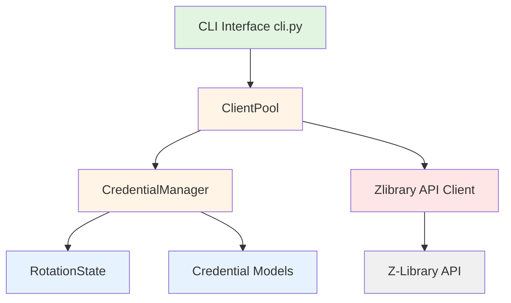

# Design Document

## Overview

The Multi-Credential Account Downloading feature adds credential rotation capabilities to the Z-Library downloader, enabling transparent management of multiple accounts to maximize download capacity and avoid rate limiting. The design introduces four new modular components that integrate seamlessly with the existing CLI-based architecture while maintaining backward compatibility.

## Steering Document Alignment

### Technical Standards (tech.md)

This design follows Python best practices:
- Uses dataclasses for data models (Credential)
- Implements proper error handling with custom exceptions
- Follows PEP 8 naming conventions
- Uses type hints throughout for better code quality
- Leverages existing patterns from the zlibrary_downloader codebase

### Project Structure (structure.md)

The implementation follows the existing project organization:
- New modules are added to the `zlibrary_downloader/` package
- Test files mirror the source structure in `tests/`
- Single credential: Configuration in `.env` file (backward compatible)
- Multiple credentials: Configuration in `zlibrary_credentials.toml` file (new, scalable format)
- State files are stored in the project root (configurable)

## Code Reuse Analysis

### Existing Components to Leverage

- **zlibrary_downloader/client.py (Zlibrary class)**: Existing Z-Library API client will be wrapped by ClientPool for credential-aware operations
- **zlibrary_downloader/cli.py**: Existing CLI interface will be extended to support credential management without breaking existing functionality
- **python-dotenv library**: Already used for `.env` file parsing, will continue to support single-credential backward compatibility
- **TOML parsing (tomllib/tomli)**: Will be used for multi-credential configuration (Python 3.11+ has built-in tomllib, older versions use tomli)
- **Existing error handling patterns**: Will be extended to handle credential-specific errors

### Integration Points

- **CLI Entry Point (cli.py)**: Will be modified to initialize CredentialManager and ClientPool instead of direct Zlibrary client
- **Configuration Files**:
  - `.env` for single-credential (backward compatible)
  - `zlibrary_credentials.toml` for multi-credential (new, scalable format)
- **Z-Library API**: All credential types (email/password and remix tokens) are already supported by the existing Zlibrary client

## Architecture

The design introduces a layered architecture with clear separation of concerns:

### Modular Design Principles

- **Single File Responsibility**:
  - `credential.py` handles credential data modeling only
  - `credential_manager.py` handles credential lifecycle and rotation logic
  - `rotation_state.py` handles state persistence only
  - `client_pool.py` manages Zlibrary client instances with credential awareness

- **Component Isolation**: Each component can be tested independently with minimal mocking

- **Service Layer Separation**:
  - Data layer: Credential data model and state persistence
  - Business logic: CredentialManager handles rotation rules
  - Client layer: ClientPool manages API client instances
  - Presentation layer: CLI displays status and handles user interaction



## Components and Interfaces

### Component 1: Credential Data Model

- **File**: `zlibrary_downloader/credential.py`
- **Purpose**: Represent individual credential with status tracking
- **Interfaces**:
  ```python
  class CredentialStatus(Enum):
      VALID = "valid"
      INVALID = "invalid"
      EXHAUSTED = "exhausted"

  @dataclass
  class Credential:
      identifier: str
      email: Optional[str] = None
      password: Optional[str] = None
      remix_userid: Optional[str] = None
      remix_userkey: Optional[str] = None
      status: CredentialStatus = CredentialStatus.VALID
      downloads_left: int = -1
      last_used: Optional[datetime] = None
      last_validated: Optional[datetime] = None

      def is_available() -> bool
      def to_dict() -> dict
      @staticmethod
      def from_dict(data: dict) -> Credential
  ```
- **Dependencies**: Python standard library (dataclasses, enum, datetime)
- **Reuses**: None (foundational component)

### Component 2: Credential Manager

- **File**: `zlibrary_downloader/credential_manager.py`
- **Purpose**: Manage credential loading, validation, and rotation logic
- **Interfaces**:
  ```python
  class CredentialManager:
      def __init__(self, state_file: str = ".zlibrary_rotation_state", config_file: str = "zlibrary_credentials.toml")
      def load_credentials() -> List[Credential]
      def validate_credential(cred: Credential, zlibrary_client: Zlibrary) -> bool
      def get_current() -> Credential
      def rotate() -> Credential
      def update_downloads_left(identifier: str, limit: int) -> None
      def get_available() -> List[Credential]
      def save_state() -> None
      def load_state() -> None
  ```
- **Dependencies**: Credential, RotationState, tomllib/tomli (TOML parsing), os.environ (dotenv for backward compatibility)
- **Reuses**: Existing Zlibrary client for credential validation via getProfile()

### Component 3: Rotation State

- **File**: `zlibrary_downloader/rotation_state.py`
- **Purpose**: Handle persistent storage of rotation state
- **Interfaces**:
  ```python
  class RotationState:
      def __init__(self, state_file: str)
      def save(self, current_index: int, credentials_status: Dict[str, dict]) -> None
      def load() -> Tuple[int, Dict[str, dict]]
      def exists() -> bool
      def validate() -> bool
  ```
- **Dependencies**: json, pathlib
- **Reuses**: None (independent state management)

### Component 4: Client Pool

- **File**: `zlibrary_downloader/client_pool.py`
- **Purpose**: Cache Zlibrary client instances and provide credential-aware client access
- **Interfaces**:
  ```python
  class ZlibraryClientPool:
      def __init__(self, credential_manager: CredentialManager)
      def get_current_client() -> Zlibrary
      def rotate_client() -> Zlibrary
      def validate_all() -> Dict[str, bool]
      def refresh_client(identifier: str) -> Zlibrary
  ```
- **Dependencies**: CredentialManager, Zlibrary client
- **Reuses**: Existing Zlibrary client class for API operations

## Data Models

### Credential Model

```python
{
    "identifier": "user@example.com",  # Email or user ID for identification
    "email": "user@example.com",       # For email/password auth (optional)
    "password": "password123",         # For email/password auth (optional)
    "remix_userid": "123456",          # For remix token auth (optional)
    "remix_userkey": "remix_key",      # For remix token auth (optional)
    "status": "valid",                 # VALID, INVALID, or EXHAUSTED
    "downloads_left": 10,              # Remaining download quota
    "last_used": "2024-10-16T12:30:45Z",      # ISO datetime
    "last_validated": "2024-10-16T10:00:00Z"  # ISO datetime
}
```

### Rotation State Model

```json
{
    "current_index": 1,
    "last_rotation": "2024-10-16T12:30:45Z",
    "credentials_status": {
        "user1@example.com": {
            "last_used": "2024-10-16T12:30:45Z",
            "downloads_left": 8,
            "status": "valid"
        },
        "user2@example.com": {
            "last_used": "2024-10-16T12:15:30Z",
            "downloads_left": 0,
            "status": "exhausted"
        }
    }
}
```

### Configuration File Formats

#### Single Credential - .env (Backward Compatible)
```env
ZLIBRARY_EMAIL=user@example.com
ZLIBRARY_PASSWORD=password123
```

Or with remix tokens:
```env
ZLIBRARY_REMIX_USERID=123456789
ZLIBRARY_REMIX_USERKEY=remix_token_key
```

#### Multiple Credentials - zlibrary_credentials.toml (New, Scalable)

```toml
# Z-Library Credentials Configuration
# Support unlimited accounts with structured data format

# Optional: Override default state file location
state_file = ".zlibrary_rotation_state"

# Credentials array - each entry represents one account
[[credentials]]
name = "Primary Account"
email = "user1@example.com"
password = "password1"
enabled = true

[[credentials]]
name = "Secondary Account"
email = "user2@example.com"
password = "password2"
enabled = true

[[credentials]]
name = "Backup Account - Remix Token"
remix_userid = "123456789"
remix_userkey = "your_remix_token_key_here"
enabled = true

# You can disable accounts without deleting them
[[credentials]]
name = "Disabled Account"
email = "user3@example.com"
password = "password3"
enabled = false
```

**Benefits of TOML format**:
- Unlimited credentials (not limited to numbered indexes)
- More readable and maintainable than .env
- Supports comments for documentation
- Structured data with clear sections
- Can enable/disable accounts without deletion
- Native Python support (Python 3.11+ built-in, tomli for older versions)
- Industry standard for Python configuration (like pyproject.toml)

## Error Handling

### Error Scenarios

1. **Invalid Credentials During Startup**
   - **Handling**: Log warning with credential identifier (not password), mark credential as INVALID, continue with remaining credentials
   - **User Impact**: User sees warning message: "Credential 'user@example.com' failed validation. Skipping."

2. **All Credentials Invalid**
   - **Handling**: Raise exception, display clear error message, exit gracefully
   - **User Impact**: User sees: "Error: No valid credentials available. Please check your .env configuration."

3. **Credential Exhausted During Operation**
   - **Handling**: Skip to next available credential, log rotation event, continue operation
   - **User Impact**: User sees: "Account 'user1@example.com' exhausted. Rotating to next account..."

4. **State File Corrupted**
   - **Handling**: Log warning, delete corrupted state, initialize fresh state
   - **User Impact**: User sees: "Warning: Rotation state corrupted. Starting fresh rotation cycle."

5. **No Available Credentials (All Exhausted)**
   - **Handling**: Return error to user, do not perform operation
   - **User Impact**: User sees: "Error: All accounts have reached their download limits. Please wait or add more accounts."

6. **Network Error During Validation**
   - **Handling**: Retry up to 2 times, if still failing mark as temporarily invalid
   - **User Impact**: User sees: "Warning: Could not validate 'user@example.com' due to network issues. Will retry."

## Testing Strategy

### Unit Testing

- **credential.py**: Test Credential data model serialization/deserialization, status checks, validation logic
- **credential_manager.py**: Test credential loading (both formats), rotation logic, filtering, state management
- **rotation_state.py**: Test state save/load, corruption handling, file permissions
- **client_pool.py**: Test client caching, rotation, validation, refresh logic
- Target: >80% code coverage for all new modules

### Integration Testing

- **Multi-credential authentication**: Test login with 3 different accounts (email/password and remix)
- **Search with rotation**: Perform 5 searches and verify rotation occurs after each
- **Download with rotation**: Perform 5 downloads and verify rotation and limit tracking
- **Fallback mechanisms**: Simulate credential failure and verify fallback to next credential
- **State persistence**: Restart application and verify rotation state is restored

### End-to-End Testing

- **Full workflow with 2-3 accounts**: Configure multiple accounts, perform 10+ operations, verify seamless rotation
- **Credential exhaustion scenarios**: Exhaust one account, verify automatic skip to next
- **Error recovery**: Simulate various error conditions and verify graceful handling
- **Backward compatibility**: Test with single-credential `.env` format

### Performance Tests

- **Rotation overhead**: Measure time added by rotation logic (target: <100ms)
- **State file I/O**: Measure state save/load performance (target: <50ms)
- **Client caching efficiency**: Verify no repeated authentication for same credential

## Integration with Existing Code

### Changes to cli.py

1. **load_credentials() function**:
   - Replace direct environment variable reading with CredentialManager.load_credentials()
   - Auto-detect configuration format:
     - Check for `zlibrary_credentials.toml` (multi-credential)
     - Fall back to `.env` (single-credential, backward compatible)

2. **initialize_zlibrary() function**:
   - Replace direct Zlibrary client creation with ClientPool.get_current_client()
   - Add credential status display on startup

3. **search_books() function**:
   - Add ClientPool.rotate_client() call after successful search
   - Update to use current client from pool

4. **download_book() function**:
   - Add ClientPool.rotate_client() call after successful download
   - Update download limit tracking via CredentialManager
   - Add error handling for exhausted credentials

5. **New display_credential_status() function**:
   - Show summary of available accounts and their status
   - Display remaining downloads per account

### New Configuration Detection Logic

```python
def detect_credential_source() -> str:
    """Detect configuration source for credentials."""
    # Check for TOML config file (multi-credential)
    if Path("zlibrary_credentials.toml").exists():
        return "toml"
    # Fall back to .env (single-credential, backward compatible)
    elif os.getenv("ZLIBRARY_EMAIL") or os.getenv("ZLIBRARY_REMIX_USERID"):
        return "env"
    else:
        raise ValueError("No Z-Library credentials found. Create .env or zlibrary_credentials.toml")

def load_from_toml(config_file: str = "zlibrary_credentials.toml") -> List[Credential]:
    """Load credentials from TOML file."""
    try:
        # Python 3.11+
        import tomllib
    except ImportError:
        # Python 3.6-3.10
        import tomli as tomllib

    with open(config_file, "rb") as f:
        config = tomllib.load(f)

    credentials = []
    for cred_data in config.get("credentials", []):
        if not cred_data.get("enabled", True):
            continue  # Skip disabled credentials

        # Create Credential object from TOML data
        # ... (implementation details)

    return credentials

def load_from_env() -> List[Credential]:
    """Load single credential from .env file (backward compatible)."""
    # ... (existing implementation)
```

## Backward Compatibility

- **Single credential** `.env` format (`ZLIBRARY_EMAIL` + `ZLIBRARY_PASSWORD`) continues to work unchanged
- **Auto-detection** of configuration source ensures seamless transition:
  - If `zlibrary_credentials.toml` exists → use TOML (multi-credential)
  - Otherwise → fall back to `.env` (single-credential)
- **No breaking changes** to CLI interface or command-line arguments
- **Existing scripts** and automation continue to work without modification
- **State file** is optional - system works without it (just starts from index 0)
- **Migration path**: Users can move from `.env` to TOML at their convenience

## Security Considerations

- **Credential Logging**: Never log passwords or API keys. Only log identifiers (email/user ID) for debugging
- **Error Message Sanitization**: Ensure error messages do not expose credentials
- **File Permissions**:
  - TOML config file: Set chmod 600 on Unix systems, warn on Windows
  - State file: Set chmod 600 on Unix systems
- **Input Validation**: Validate all credential data before use
- **Memory Security**: Clear credential data from memory when no longer needed (future enhancement)
- **TOML File Security**: Add `zlibrary_credentials.toml` to `.gitignore` to prevent accidental commits

## Performance Considerations

- **Client Caching**: Cache Zlibrary client instances to avoid repeated authentication (reduces latency by ~500ms per operation)
- **Lazy Validation**: Only validate credentials when first used, not all at startup (reduces startup time)
- **State File Optimization**: Only write state file when rotation occurs, not on every operation
- **Async Validation**: Consider async validation for large credential sets (10+) in future enhancement

## Workflow Diagrams

### Startup Flow

```
Application Start
    ↓
Detect configuration source
    ├─ zlibrary_credentials.toml exists? → Load TOML (multi-credential)
    └─ Otherwise → Load .env (single-credential)
    ↓
Create CredentialManager
    ↓
Load credentials from detected source
    ↓
Load previous rotation state (if exists)
    ↓
Initialize ClientPool
    ↓
Validate first credential (lazy)
    ↓
Display credential summary
    ↓
Ready for operations
```

### Operation Flow

```
User initiates search/download
    ↓
ClientPool.get_current_client()
    ↓
Check credential status
    ├─ Valid → Use client
    ├─ Exhausted → Rotate, retry
    └─ Invalid → Rotate, retry
    ↓
Execute operation
    ↓
On success:
    ├─ Update download count
    ├─ Rotate to next credential
    └─ Save state
    ↓
On failure:
    ├─ Log error
    ├─ Rotate to next credential
    └─ Retry (up to N times)
```

### Rotation Flow

```
CredentialManager.rotate()
    ↓
Increment current_index
    ↓
Check if index >= len(credentials)
    ├─ Yes → Wrap to 0
    └─ No → Continue
    ↓
Get credential at current_index
    ↓
Check if credential.is_available()
    ├─ Yes → Return credential
    └─ No → Increment index, retry
    ↓
If all exhausted → Raise exception
    ↓
Update rotation state
    ↓
Save state to file
```
