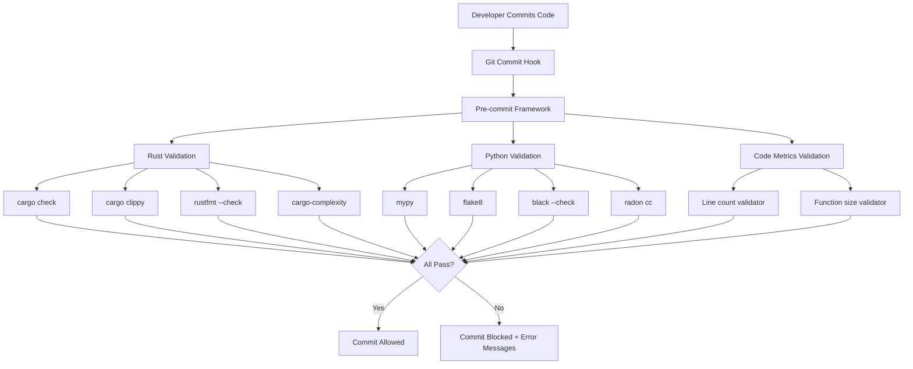

# Design Document

## Overview

This design implements a comprehensive Quality Assurance (QA) compliance infrastructure for the to_texts monorepo. The system establishes automated validation of code quality through pre-commit hooks, static analysis, type checking, and complexity measurement across both Rust and Python codebases.

The design follows a layered approach:
1. **Git Hook Layer**: Pre-commit framework intercepts commits
2. **Validation Layer**: Individual quality tools (type checkers, linters, formatters)
3. **Configuration Layer**: Centralized tool configuration files
4. **Reporting Layer**: Clear, actionable feedback to developers

The implementation prioritizes developer experience with fast feedback, clear error messages, and auto-fixing capabilities where possible.

## Steering Document Alignment

### Technical Standards (tech.md)

**Quality Assurance Tooling (Section: Code Quality Tools)**

The design directly implements the quality tools specified in tech.md:

**Rust:**
- `cargo clippy`: Static analysis and linting
- `rustfmt`: Code formatting
- `cargo check`: Type checking and compilation
- `cargo-complexity` or `rust-code-analysis`: Cyclomatic complexity measurement

**Python:**
- `mypy`: Static type checking
- `black`: Code formatting (line-length: 100)
- `flake8`: Linting and style enforcement
- `radon`: Cyclomatic complexity measurement
- `pytest` + `pytest-cov`: Testing and coverage

**Pre-commit Framework:**
- Git hooks using `pre-commit` framework
- Automated validation enforcing all metrics

**Alignment with Known Limitations (tech.md Section)**

Addresses limitation #9: "Type Hints Incomplete (Python)"
- Design includes complete type hint coverage for all Python modules

Addresses limitation #10: "Cyclomatic Complexity Violations"
- Design includes complexity audit and refactoring approach

### Project Structure (structure.md)

**Configuration Files (Section: Configuration Management)**

New configuration files will be added:
```
to_texts/
├── .pre-commit-config.yaml        # Pre-commit hook configuration
├── .flake8                         # Python linting configuration
└── packages/
    └── python/
        └── zlibrary-downloader/
            └── pyproject.toml      # Extended with mypy, black, pytest config
```

**Code Quality Integration (Section: Quality Enforcement)**

Implements the pre-commit hooks structure defined in structure.md:
- Rust checks: cargo-check, cargo-clippy, cargo-fmt, cargo-complexity
- Python checks: mypy, flake8, black, radon-complexity
- Code metrics: line-count-validator, function-size-validator

**Code Size Guidelines (Section: Code Size Guidelines)**

Automated enforcement of:
- Maximum 400 lines per file
- Maximum 30 lines per function
- Maximum cyclomatic complexity of 10

## Code Reuse Analysis

### Existing Components to Leverage

**Build System:**
- **Cargo workspace** (`packages/rust/Cargo.toml`): Already configured for workspace-level commands
- **pyproject.toml** (`packages/python/zlibrary-downloader/pyproject.toml`): Extend for tool configuration

**Version Control:**
- **Git repository**: Use `.git/hooks` directory for pre-commit hooks
- **.gitignore**: Already excludes build artifacts, will work with new tooling

**Documentation:**
- **README.md files**: Extend with QA setup instructions
- **Existing structure**: Follow established documentation patterns

### Integration Points

**Development Workflow:**
- Integrate with existing `cargo build`, `cargo test` workflow
- Integrate with existing `./scripts/run.sh` Python workflow
- No changes to runtime behavior, only development-time validation

**CI/CD (Future):**
- Same tool configuration will be reusable in GitHub Actions
- Tools run locally before commit = same checks in CI/CD

**IDE Integration:**
- Configuration files compatible with VS Code, PyCharm, IntelliJ Rust
- Developers can run tools via IDE or command line

## Architecture

### Layered Architecture



### Modular Design Principles

**Single File Responsibility:**
- Each configuration file controls one tool or tool category
- Pre-commit config orchestrates but doesn't implement checks

**Component Isolation:**
- Each quality tool is independent
- Tools can be enabled/disabled individually in pre-commit config
- Failure of one tool doesn't prevent others from running (fail-fast or continue-on-error configurable)

**Service Layer Separation:**
- Git hooks (orchestration layer)
- Validation tools (business logic layer)
- Configuration files (data layer)
- Error reporting (presentation layer)

**Utility Modularity:**
- Custom validators (line count, function size) as separate scripts
- Reusable across Rust and Python with different parsers

## Tool Selection and Rationale

### Pre-commit Framework

**Selected: `pre-commit` (https://pre-commit.com/)**

**Version:** ≥3.0.0 (latest stable: 3.6.0 as of 2025)

**Rationale:**
- Language-agnostic: Works with Rust, Python, and custom scripts
- Declarative configuration via YAML
- Built-in caching for performance
- Large ecosystem of pre-built hooks
- Supports both local and remote hooks
- Active maintenance and community support

**Alternatives Considered:**
- **husky** (JavaScript-focused, less suitable for Rust)
- **Git hooks directly** (no caching, no framework, harder to maintain)
- **lefthook** (Good alternative, but pre-commit has larger ecosystem)

**Installation:**
```bash
pip install pre-commit
pre-commit install
```

### Rust Quality Tools

#### 1. Type Checking: `cargo check`

**Version:** Built into Rust toolchain (rustc)

**Rationale:**
- Official Rust compiler type checking
- Zero additional dependencies
- Fastest way to verify code compiles
- Catches type errors, borrow checker violations

**Configuration:** None needed (inherits from Cargo.toml)

#### 2. Linting: `cargo clippy`

**Version:** Latest stable (ships with rustup)

**Rationale:**
- Official Rust linter
- Catches common mistakes and anti-patterns
- Suggests idiomatic Rust code
- Configurable lint levels

**Configuration:** Via `Cargo.toml` or `clippy.toml`
```toml
[workspace.lints.clippy]
all = "warn"
pedantic = "warn"
unwrap_used = "deny"
expect_used = "deny"
```

**Alternatives Considered:**
- None (clippy is the standard)

#### 3. Formatting: `rustfmt`

**Version:** Latest stable (ships with rustup)

**Rationale:**
- Official Rust formatter
- Enforces consistent style
- Zero-configuration by default
- Fast and deterministic

**Configuration:** Via `rustfmt.toml` (optional, defaults are good)

**Alternatives Considered:**
- None (rustfmt is the standard)

#### 4. Complexity Analysis: `rust-code-analysis`

**Selected: `rust-code-analysis-cli`**

**Version:** ≥0.0.25

**Rationale:**
- Purpose-built for Rust
- Provides cyclomatic complexity (CC), cognitive complexity (CogC)
- JSON output for parsing
- Actively maintained by Mozilla

**Installation:**
```bash
cargo install rust-code-analysis-cli
```

**Alternatives Considered:**
- **cargo-complexity** (deprecated, unmaintained)
- **scc** (good for SLOC, less detailed complexity metrics)

**Usage:**
```bash
rust-code-analysis-cli --metrics -O json -p src/
```

### Python Quality Tools

#### 1. Type Checking: `mypy`

**Version:** ≥1.8.0 (latest: 1.8.x as of 2025)

**Rationale:**
- Official Python type checker
- Strict mode for maximum type safety
- Fast incremental checking
- Excellent error messages
- Active development

**Configuration:** Via `pyproject.toml`
```toml
[tool.mypy]
python_version = "3.8"
strict = true
warn_return_any = true
warn_unused_configs = true
disallow_untyped_defs = true
disallow_any_unimported = true
no_implicit_optional = true
warn_redundant_casts = true
warn_unused_ignores = true
```

**Alternatives Considered:**
- **pyright** (faster, but less mature ecosystem)
- **pyre** (Facebook's type checker, less widely adopted)

#### 2. Linting: `flake8`

**Version:** ≥7.0.0 (latest stable)

**Rationale:**
- Combines PyFlakes, pycodestyle, mccabe
- Fast and lightweight
- Widely adopted standard
- Extensive plugin ecosystem

**Plugins:**
- `flake8-bugbear`: Additional bug detection
- `flake8-comprehensions`: List/dict comprehension improvements
- `flake8-simplify`: Code simplification suggestions

**Configuration:** Via `.flake8` or `pyproject.toml` (with flake8-pyproject plugin)
```ini
[flake8]
max-line-length = 100
max-complexity = 10
extend-ignore = E203, W503
exclude = venv/, .git/, __pycache__, *.egg-info
```

**Alternatives Considered:**
- **pylint** (slower, more opinionated, overlaps with mypy)
- **ruff** (very fast, but newer, less stable as of 2025)

#### 3. Formatting: `black`

**Version:** ≥24.0.0 (latest stable)

**Rationale:**
- Opinionated formatter, no configuration debates
- Fast and deterministic
- Widely adopted (de facto standard)
- Excellent git diff minimization

**Configuration:** Via `pyproject.toml`
```toml
[tool.black]
line-length = 100
target-version = ['py38']
```

**Alternatives Considered:**
- **autopep8** (less opinionated, more configuration needed)
- **yapf** (more configurable, but inconsistent results)

#### 4. Complexity Analysis: `radon`

**Version:** ≥6.0.0

**Rationale:**
- Comprehensive metrics (CC, MI, raw metrics, Halstead)
- JSON output for automation
- Well-maintained
- Easy integration with pre-commit

**Installation:**
```bash
pip install radon
```

**Usage:**
```bash
radon cc --min C --json zlibrary_downloader/
```

**Alternatives Considered:**
- **mccabe** (included in flake8, but limited output options)
- **wily** (tracks complexity over time, overkill for this use case)

#### 5. Testing: `pytest` + `pytest-cov`

**Version:**
- `pytest` ≥8.0.0
- `pytest-cov` ≥4.1.0

**Rationale:**
- Industry standard Python testing framework
- Excellent fixture system
- Rich plugin ecosystem
- Coverage integration via pytest-cov

**Configuration:** Via `pyproject.toml`
```toml
[tool.pytest.ini_options]
testpaths = ["tests"]
python_files = ["test_*.py", "*_test.py"]
addopts = "--cov=zlibrary_downloader --cov-report=term-missing --cov-report=html"
```

**Alternatives Considered:**
- **unittest** (stdlib, less features)
- **nose2** (less active development)

### Code Metrics Validation

#### Custom Validators

**1. Line Count Validator**

**Implementation:** Custom Python script

**Logic:**
```python
def validate_line_count(file_path, max_lines=400):
    # Count non-empty, non-comment lines
    # Exclude test files, generated code
    # Return (pass: bool, count: int, message: str)
```

**2. Function Size Validator**

**Implementation:** Custom Python script using AST parsing

**Logic:**
```python
def validate_function_size(file_path, max_lines=30):
    # Parse with ast.parse() for Python
    # Parse with syn for Rust
    # Count lines per function excluding signature, docstring
    # Return violations list
```

**Rust Parsing:** Use `syn` crate or `rust-code-analysis` output

**Python Parsing:** Use `ast` module from stdlib

## Components and Interfaces

### Component 1: Pre-commit Configuration

**Purpose:** Orchestrate all quality checks in a single hook

**File:** `.pre-commit-config.yaml`

**Structure:**
```yaml
repos:
  - repo: local
    hooks:
      # Rust checks
      - id: cargo-check
        name: Rust type checking
        entry: cargo check
        language: system
        files: \.rs$
        pass_filenames: false

      - id: cargo-clippy
        name: Rust linting
        entry: cargo clippy -- -D warnings
        language: system
        files: \.rs$
        pass_filenames: false

      - id: rustfmt
        name: Rust formatting
        entry: cargo fmt --check
        language: system
        files: \.rs$
        pass_filenames: false

      - id: rust-complexity
        name: Rust complexity check
        entry: scripts/check_rust_complexity.sh
        language: script
        files: \.rs$

      # Python checks
      - id: mypy
        name: Python type checking
        entry: mypy
        language: system
        types: [python]
        args: [--strict]

      - id: flake8
        name: Python linting
        entry: flake8
        language: system
        types: [python]

      - id: black-check
        name: Python formatting
        entry: black --check
        language: system
        types: [python]

      - id: radon-complexity
        name: Python complexity check
        entry: scripts/check_python_complexity.sh
        language: script
        types: [python]

      # Code metrics
      - id: line-count
        name: Line count validation
        entry: scripts/validate_line_count.py
        language: script
        files: \.(rs|py)$

      - id: function-size
        name: Function size validation
        entry: scripts/validate_function_size.py
        language: script
        files: \.(rs|py)$
```

**Interface:**
- Input: Modified files from git staging area
- Output: Pass/fail + error messages
- Exit codes: 0 (pass), non-zero (fail)

### Component 2: Rust Complexity Checker

**Purpose:** Validate cyclomatic complexity ≤10 for Rust code

**File:** `scripts/check_rust_complexity.sh`

**Implementation:**
```bash
#!/bin/bash
set -e

# Run rust-code-analysis on Rust packages
rust-code-analysis-cli --metrics -O json -p packages/rust/text-extractor/src/ > /tmp/rust_metrics.json

# Parse JSON and check complexity
python3 scripts/parse_rust_complexity.py /tmp/rust_metrics.json 10
```

**Dependencies:**
- `rust-code-analysis-cli` (installed via cargo)
- `scripts/parse_rust_complexity.py` (custom parser)

**Interface:**
- Input: Rust source files
- Output: List of functions exceeding complexity threshold
- Exit code: 0 (pass), 1 (violations found)

### Component 3: Python Complexity Checker

**Purpose:** Validate cyclomatic complexity ≤10 for Python code

**File:** `scripts/check_python_complexity.sh`

**Implementation:**
```bash
#!/bin/bash
set -e

# Run radon on Python package
radon cc --min C --json packages/python/zlibrary-downloader/zlibrary_downloader/ > /tmp/python_metrics.json

# Parse JSON and check complexity
python3 scripts/parse_python_complexity.py /tmp/python_metrics.json 10
```

**Dependencies:**
- `radon` (installed via pip)
- `scripts/parse_python_complexity.py` (custom parser)

**Interface:**
- Input: Python source files
- Output: List of functions exceeding complexity threshold
- Exit code: 0 (pass), 1 (violations found)

### Component 4: Line Count Validator

**Purpose:** Enforce 400 line limit per file

**File:** `scripts/validate_line_count.py`

**Implementation:**
```python
#!/usr/bin/env python3
import sys
import os

MAX_LINES = 400
EXCLUDE_PATTERNS = ['test_', '_test.', 'target/', 'venv/', '__pycache__']

def count_lines(file_path):
    """Count non-empty lines, excluding comments."""
    # Implementation specific to file extension

def is_excluded(file_path):
    """Check if file should be excluded."""
    return any(pattern in file_path for pattern in EXCLUDE_PATTERNS)

def main(files):
    violations = []
    for file_path in files:
        if is_excluded(file_path):
            continue
        count = count_lines(file_path)
        if count > MAX_LINES:
            violations.append((file_path, count))

    if violations:
        print("Line count violations:")
        for path, count in violations:
            print(f"  {path}: {count} lines (max: {MAX_LINES})")
        sys.exit(1)
    sys.exit(0)

if __name__ == "__main__":
    main(sys.argv[1:])
```

**Interface:**
- Input: List of file paths (from pre-commit)
- Output: Violation report
- Exit code: 0 (pass), 1 (violations)

### Component 5: Function Size Validator

**Purpose:** Enforce 30 line limit per function

**File:** `scripts/validate_function_size.py`

**Implementation:**
```python
#!/usr/bin/env python3
import sys
import ast

MAX_FUNCTION_LINES = 30

def validate_python_file(file_path):
    """Validate Python file function sizes."""
    with open(file_path) as f:
        tree = ast.parse(f.read(), filename=file_path)

    violations = []
    for node in ast.walk(tree):
        if isinstance(node, (ast.FunctionDef, ast.AsyncFunctionDef)):
            func_lines = node.end_lineno - node.lineno
            if func_lines > MAX_FUNCTION_LINES:
                violations.append((node.name, node.lineno, func_lines))
    return violations

def validate_rust_file(file_path):
    """Validate Rust file function sizes (basic approach)."""
    # Parse with regex or rust-code-analysis output
    # Count lines between 'fn name' and matching '}'
    pass

def main(files):
    violations = {}
    for file_path in files:
        if file_path.endswith('.py'):
            file_violations = validate_python_file(file_path)
        elif file_path.endswith('.rs'):
            file_violations = validate_rust_file(file_path)
        else:
            continue

        if file_violations:
            violations[file_path] = file_violations

    if violations:
        print("Function size violations:")
        for path, funcs in violations.items():
            print(f"  {path}:")
            for name, line, count in funcs:
                print(f"    {name} (line {line}): {count} lines (max: {MAX_FUNCTION_LINES})")
        sys.exit(1)
    sys.exit(0)

if __name__ == "__main__":
    main(sys.argv[1:])
```

**Interface:**
- Input: List of file paths
- Output: Violation report with function names and locations
- Exit code: 0 (pass), 1 (violations)

### Component 6: Type Hint Coverage Script

**Purpose:** Add type hints to Python code systematically

**File:** `scripts/add_type_hints.py` (development tool, not in pre-commit)

**Approach:**
1. Use `monkeytype` to generate type hints from runtime
2. Review and apply generated types
3. Manually add remaining hints
4. Verify with mypy --strict

**Process:**
```bash
# Install monkeytype
pip install monkeytype

# Run code with monkeytype tracing
monkeytype run -m pytest

# Generate stubs
monkeytype stub zlibrary_downloader.cli
monkeytype stub zlibrary_downloader.client
monkeytype stub zlibrary_downloader.tui

# Apply stubs
monkeytype apply zlibrary_downloader.cli
# ... review and commit
```

## Configuration Files

### 1. Pre-commit Configuration

**File:** `.pre-commit-config.yaml`

**Location:** Repository root

**Content:** See Component 1 above

### 2. Python Tool Configuration

**File:** `packages/python/zlibrary-downloader/pyproject.toml`

**Extensions:**
```toml
[tool.mypy]
python_version = "3.8"
strict = true
warn_return_any = true
warn_unused_configs = true
disallow_untyped_defs = true
disallow_any_unimported = true
no_implicit_optional = true
warn_redundant_casts = true
warn_unused_ignores = true
warn_no_return = true
warn_unreachable = true

[tool.black]
line-length = 100
target-version = ['py38']
exclude = '''
/(
    \.git
  | \.venv
  | venv
  | __pycache__
  | \.eggs
  | \.egg-info
)/
'''

[tool.pytest.ini_options]
testpaths = ["tests"]
python_files = ["test_*.py", "*_test.py"]
python_classes = ["Test*"]
python_functions = ["test_*"]
addopts = """
    --cov=zlibrary_downloader
    --cov-report=term-missing
    --cov-report=html
    --cov-fail-under=80
    --strict-markers
    -v
"""

[tool.coverage.run]
source = ["zlibrary_downloader"]
omit = ["*/tests/*", "*/venv/*"]

[tool.coverage.report]
exclude_lines = [
    "pragma: no cover",
    "def __repr__",
    "raise AssertionError",
    "raise NotImplementedError",
    "if __name__ == .__main__.:",
    "if TYPE_CHECKING:",
]
```

### 3. Flake8 Configuration

**File:** `.flake8`

**Location:** Repository root or Python package root

**Content:**
```ini
[flake8]
max-line-length = 100
max-complexity = 10
extend-ignore = E203, W503, E501
exclude =
    .git,
    __pycache__,
    venv,
    .venv,
    *.egg-info,
    build,
    dist
per-file-ignores =
    __init__.py:F401
```

### 4. Rust Clippy Configuration

**File:** `packages/rust/Cargo.toml`

**Extensions:**
```toml
[workspace.lints.clippy]
all = "warn"
pedantic = "warn"
unwrap_used = "deny"
expect_used = "deny"
panic = "deny"
missing_docs_in_private_items = "warn"
```

### 5. Rustfmt Configuration

**File:** `rustfmt.toml` (optional)

**Location:** Repository root or Rust workspace root

**Content:** (use defaults, or customize)
```toml
edition = "2021"
max_width = 100
tab_spaces = 4
```

## Error Handling

### Error Scenario 1: Pre-commit Tool Not Installed

**Scenario:** Developer clones repo but hasn't run `pre-commit install`

**Handling:**
- Commit proceeds without checks (git default behavior)
- README instructions emphasize running `pre-commit install`

**User Impact:**
- Manual step required during setup
- Clear documentation prevents this

**Mitigation:**
- Include setup script that runs `pre-commit install`
- Consider adding to `.git/hooks/post-checkout` automation

### Error Scenario 2: Quality Check Fails

**Scenario:** Developer commits code with type errors, linting violations, etc.

**Handling:**
- Pre-commit blocks commit
- Display tool output showing specific errors
- Provide actionable error messages

**User Impact:**
```
mypy....................................................................Failed
- hook id: mypy
- exit code: 1

zlibrary_downloader/cli.py:45: error: Function is missing a return type annotation
zlibrary_downloader/client.py:123: error: Argument 1 to "search" has incompatible type "str"; expected "Optional[str]"

flake8..................................................................Failed
- hook id: flake8
- exit code: 1

zlibrary_downloader/tui.py:200:101: E501 line too long (105 > 100 characters)
```

**Resolution:** Fix errors and re-commit

### Error Scenario 3: Complexity Violation

**Scenario:** Function exceeds cyclomatic complexity of 10

**Handling:**
- Custom script reports violation with function name and complexity score
- Provide guidance on refactoring

**User Impact:**
```
Rust complexity check...................................................Failed
- hook id: rust-complexity
- exit code: 1

Complexity violations found:
  packages/rust/text-extractor/src/main.rs:
    strip_html_tags (line 157): complexity 12 (max: 10)

Suggestion: Break this function into smaller helper functions

Python complexity check.................................................Failed
- hook id: radon-complexity
- exit code: 1

Complexity violations found:
  packages/python/zlibrary-downloader/zlibrary_downloader/tui.py:
    get_search_params (line 47): complexity 11 (max: 10)
```

**Resolution:** Refactor function into smaller units

### Error Scenario 4: File Size Violation

**Scenario:** File exceeds 400 lines

**Handling:**
- Line count validator reports violation with exact count
- Suggest splitting into modules

**User Impact:**
```
Line count validation...................................................Failed
- hook id: line-count
- exit code: 1

Line count violations:
  packages/python/zlibrary-downloader/zlibrary_downloader/client.py: 428 lines (max: 400)

Suggestion: Split this file into smaller modules (e.g., client_auth.py, client_search.py)
```

**Resolution:** Refactor file into multiple modules

### Error Scenario 5: Bypassing Hooks (Emergency)

**Scenario:** Developer needs to commit urgently despite violations

**Handling:**
- Allow bypass with `git commit --no-verify`
- Document that this should be rare and requires justification

**User Impact:**
- Commit succeeds but CI/CD will catch violations later
- Team review required

**Policy:**
- Bypass only for WIP commits on feature branches
- Must fix before merging to main

### Error Scenario 6: Tool Installation Missing

**Scenario:** Required tool (mypy, radon, rust-code-analysis) not installed

**Handling:**
- Hook fails with clear error message
- Provide installation command

**User Impact:**
```
mypy....................................................................Failed
- hook id: mypy
- exit code: 127

Error: mypy is not installed.
Install with: pip install mypy>=1.8.0

Or install all dev dependencies:
  cd packages/python/zlibrary-downloader
  pip install -e ".[dev]"
```

**Resolution:** Install missing tool

## Testing Strategy

### Unit Testing: Quality Tool Scripts

**Approach:** Test custom validators in isolation

**Tests:**
1. **Line count validator**
   - Test with file exactly at 400 lines → pass
   - Test with file at 401 lines → fail
   - Test exclusion patterns work (test files ignored)

2. **Function size validator**
   - Test with function exactly at 30 lines → pass
   - Test with function at 31 lines → fail
   - Test Python AST parsing correctly counts lines
   - Test Rust function detection

3. **Complexity parsers**
   - Test parsing rust-code-analysis JSON output
   - Test parsing radon JSON output
   - Test threshold detection

**Framework:** pytest for Python validators

**Location:** `scripts/tests/`

### Integration Testing: Pre-commit Workflow

**Approach:** Test end-to-end pre-commit behavior

**Tests:**
1. **Clean commit**
   - Create compliant code change
   - Run `pre-commit run --all-files`
   - Verify exit code 0

2. **Type error commit**
   - Create code with type error
   - Attempt commit
   - Verify blocked with mypy error

3. **Formatting commit**
   - Create improperly formatted code
   - Run black auto-fix
   - Verify code reformatted

4. **Complexity violation commit**
   - Create function with complexity >10
   - Attempt commit
   - Verify blocked with complexity error

**Setup:**
- Temporary git repository for testing
- Pre-commit installed and configured
- Sample violating code

**Framework:** Bash scripts or pytest with subprocess

### End-to-End Testing: Developer Workflow

**Approach:** Simulate real developer scenarios

**Scenarios:**
1. **New developer setup**
   - Clone repository
   - Follow README setup instructions
   - Run pre-commit install
   - Make compliant change and commit successfully

2. **Fix type hints workflow**
   - Run mypy, see errors
   - Add type hints
   - Re-run mypy, verify pass
   - Commit successfully

3. **Refactor complexity workflow**
   - Run complexity check, find violation
   - Refactor function into smaller units
   - Re-run complexity check, verify pass
   - Commit successfully

**Manual Testing:**
- Document test scenarios
- Execute on fresh clone
- Verify on Linux, macOS, Windows (WSL)

### Regression Testing

**Approach:** Ensure existing code still works

**Tests:**
1. Run all existing tests after adding type hints
2. Verify Rust build still succeeds after adding clippy config
3. Verify Python package still runs after formatting with black

**Success Criteria:**
- All existing tests pass
- No runtime behavior changes
- Build/run commands unchanged

### Performance Testing

**Approach:** Measure pre-commit hook execution time

**Target:** <30 seconds for typical commit (Requirements)

**Measurements:**
1. Time each hook individually
2. Identify slowest checks
3. Optimize if needed (caching, incremental checks)

**Tools:**
- `time` command
- Pre-commit built-in timing (--verbose)

**Optimization Options:**
- Use pre-commit's file filtering (only check changed files)
- Enable caching for mypy
- Run independent checks in parallel
